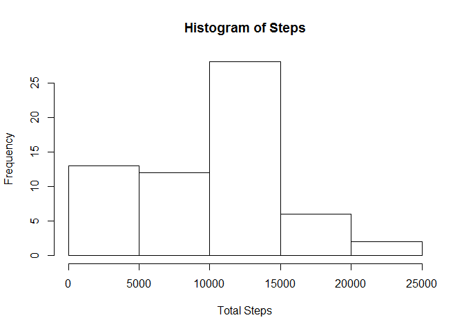
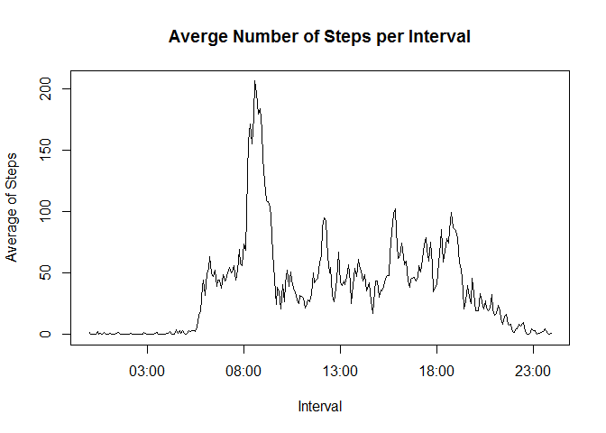
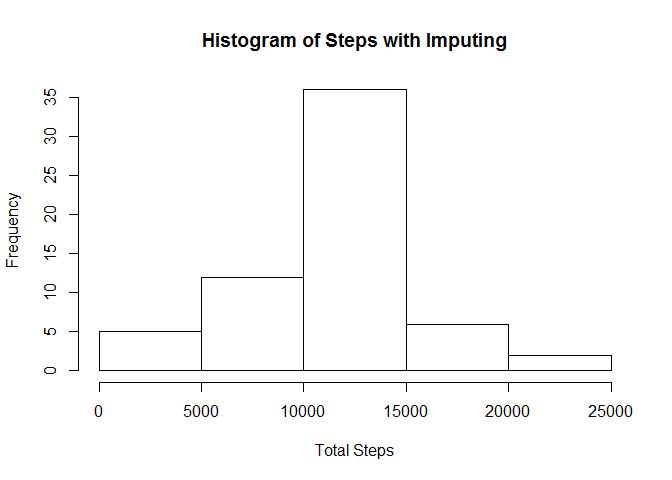
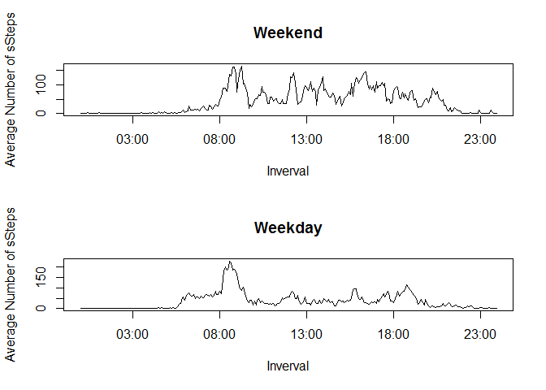

# Reproducible Research: Peer Assessment 1


## Loading and preprocessing the data
## I am not repeatedly unzipping the file

```r
data<-read.csv("activity/activity.csv")
proc_data<-as.data.frame(data)
```

## What is mean total number of steps taken per day?

```r
date_split<-as.data.frame(split(proc_data$steps,proc_data$date))
total<-numeric(61)
for(i in 1:61){total[i]<-sum(date_split[i],na.rm=TRUE)}
hist(total,xlab="Total Steps",main="Histogram of Steps")
```

 


MEAN= 9354.2295; MEDIAN =1.0395 &times; 10<sup>4</sup>


## What is the average daily activity pattern?


```r
interval_split<-as.data.frame(split(proc_data$steps,proc_data$interval))
average<-numeric(288)
for(i in 1:288){average[i]<-mean(interval_split[,i],na.rm=TRUE)}
xvec<-proc_data$interval[1:288]
yvec<-sprintf("%04d",xvec)
zvec<-paste(paste(substr(yvec,1,2),":",sep=""),substr(yvec,3,4),sep="")
tvec<-strptime(zvec,"%R")
plot(tvec,average,xlab="Interval",ylab="Average of Steps",main="Averge Number of Steps per Interval", type="l")
```

 


```r
ns<-c(-1)
int<-c(0)
for(i in 1:288){
  if(average[i]>ns)
    {ns<-average[i]
     int<-i
     }
  }
```

Interal with maximum number of steps 08:35


## Imputing missing values


```r
steps<-proc_data$steps
date<-proc_data$date
interval<-proc_data$interval
count<-0
for(i in 1:length(steps)){
  if(is.na(steps[i])){
    count<-count+1
  }
}
```

There are 2304 missing values


```r
k<-0
for(i in 1:61){
  for(j in 1:288){
    k<-k+1
    if(is.na(steps[k])){
      steps[k]<-average[j]
    }
  }
}
count<-0
for(i in 1:length(steps)){
  if(is.na(steps[i])){
    count<-count+1
  }
}
```

There are 0 missing values


```r
proc_data_new<-data.frame(steps,date,interval)
date_split<-as.data.frame(split(proc_data_new$steps,proc_data_new$date))
total1<-numeric(61)
for(i in 1:61){total1[i]<-sum(date_split[i],na.rm=TRUE)}
hist(total1,xlab="Total Steps",main="Histogram of Steps with Imputing")
```

 


MEAN with imputing= 1.0766 &times; 10<sup>4</sup>; MEDIAN with imputing =1.0766 &times; 10<sup>4</sup>

The distribution of steps with imputing id different, and appears more like a Gaussian.  The mean and median are now identical, and larger than the original case, as would be expected.


## Are there differences in activity patterns between weekdays and weekends?


```r
wvect<-weekdays(as.Date(date))
vvect<-character(length(wvect))
for(i in 1:length(wvect)){
  if(wvect[i]=="Saturday"|wvect[i]=="Sunday"){
    vvect[i]<-"WEEKEND"
    }else{
    vvect[i]<-"WEEKDAY"
  }
}
proc_data_final<-data.frame(steps,date,interval,vvect)
total_we<-numeric(288)
total_wd<-numeric(288)
count_we<-integer(288)
count_wd<-integer(288)
k<-0
for (j in 1:61){
  for (i in 1:288){
    k<-k+1
    k
    if(as.character(proc_data_final$vvect[k])=="WEEKEND"){
    count_we[i]<-count_we[i]+1
    total_we[i]<-total_we[i]+proc_data_final$steps[k]
    }else{
    count_wd[i]<-count_wd[i]+1
    total_wd[i]<-total_wd[i]+proc_data_final$steps[k]
    }
  }
}
average_we<-total_we/count_we
average_wd<-total_wd/count_wd

par(mfrow=c(2,1))

plot(tvec,average_we,type="l",xlab="Inverval",ylab="Average Number of sSteps",main="Weekend")
plot(tvec,average_wd,type="l",xlab="Inverval",ylab="Average Number of sSteps",main="Weekday")
```

 
